# SEI147 - PROJECT 04: A Django & React App
## Overview: JOBR - an app to help organise your job search
------
JOBR is a full stack app created in 8 days. It the first time the group had built a backend using Django and Python and the first time using React Hooks on the frontend.

JOBR is an app designed to help you stay on track of your job search. It allows users to sign up and upload jobs to their dashboard, write out tasks to keep track of their ‘to-do’ list, upload resources they find useful or want to refer back to later and contact information for relevant assosciates. 
Recognising users would likely use this app on their mobiles, we have made sure it is fully mobile responsive.

Please see the hosted version here:  [JOBR](http://jobrrrr.herokuapp.com)

- - - - 

### Brief
* **Build a full-stack application** by making your own backend and your own front-end
* **Use a Python Django API** using Django REST Framework to serve your data from a Postgres database
* **Consume your API with a separate front-end** built with React
* **Be a complete product** which most likely means multiple relationships and CRUD functionality for at least a couple of models
* **Implement thoughtful user stories/wireframes** that are significant enough to help you know which features are core MVP and which you can cut
* **Be deployed online** so it’s publicly accessible.
* **React Hooks** is optional for this project.

-----

### Technologies Used
* Django
* Django REST Framework
* PostgresSQL
* React
* JavaScript (ES6) / HTML5 / SCSS
* Axios
* Yarn
* React Semantic UI

-----
### Screenshot Walk-through

1. Home Page 

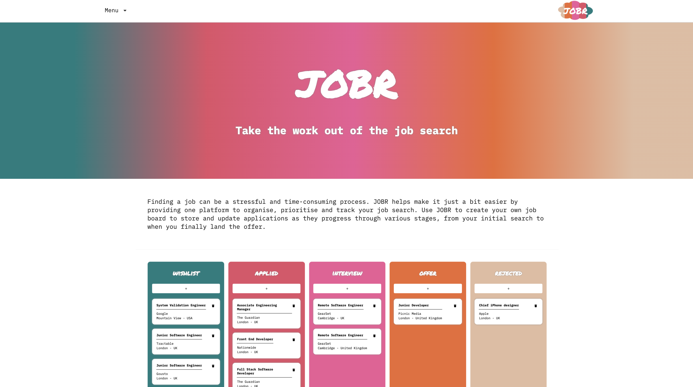

2. Register Page - users are required to be registered / logged in in order to use the app. Users recieve their token on registration so they do not need to Log In immediately after registering.

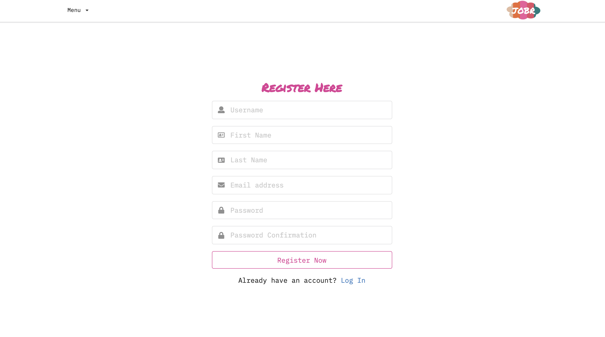

3. User Dashboard - the dashboard allows users to easily see a snapshot of each job they have uploaded and the assigned status. You can drag and drop these cards onto the other columns to update the status of the job easily or you can click on a job to view/edit all of the associated information. You can also click on any column to add a job and the status will be automatically be pre-populated.

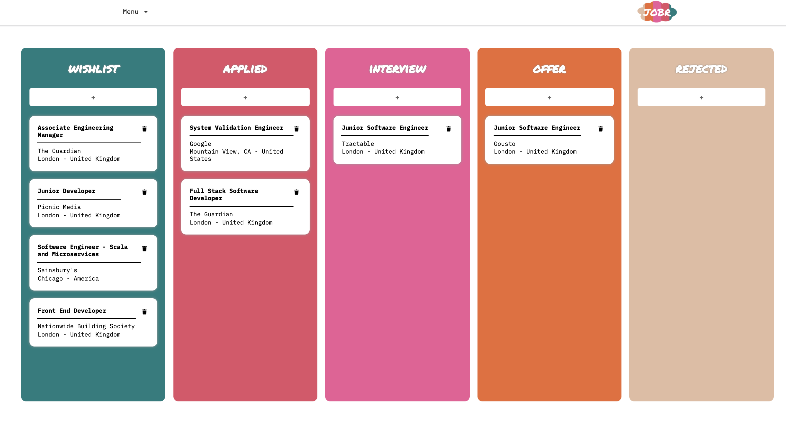 

4. Job Show Page - this page allows the user to see all the information attached to the job, including all the key dates in order to easily keep track of things. The tabs along the top of the page allow users to see any tasks and contacts they have assigned to this job.

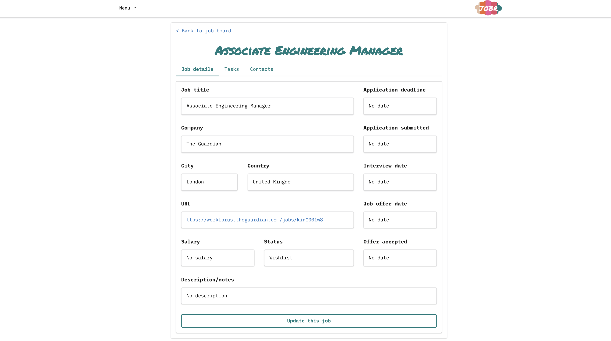 

5. Tasks Show Page - this page allows you to see all the tasks you have set yourself and tick them off as they are completed. 

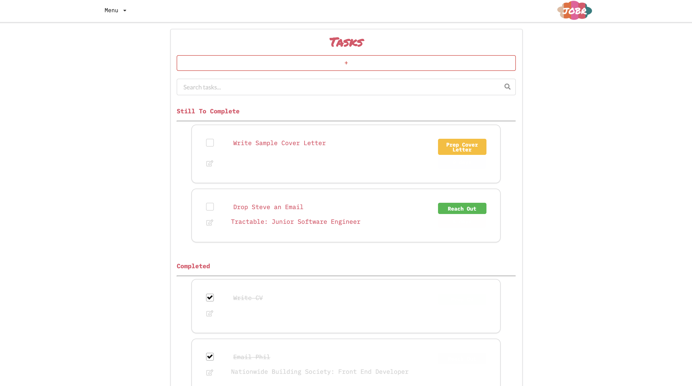 

6. Task Add / Edit (Mobile)  - on a mobile if you choose to add or edit a task you are navigated onto a separate page.  When you upload a task there are 21 categories to choose from. You can elect to attach a task to a specific job or leave it as a general task.

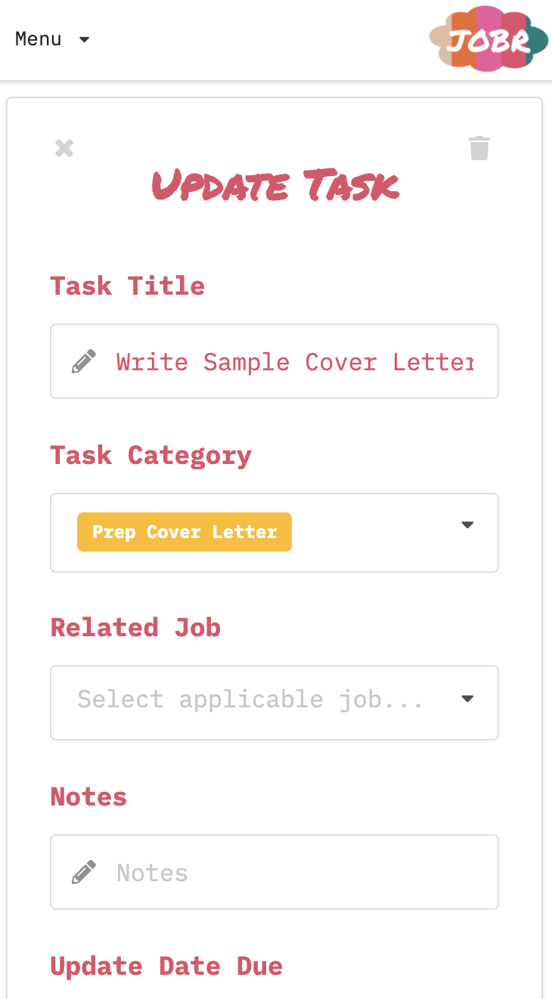 

8. Task Add / Edit (all other Devices) - if you select to add or edit a task on any other device you stay on the same page and the form drops down from the top of the page. 

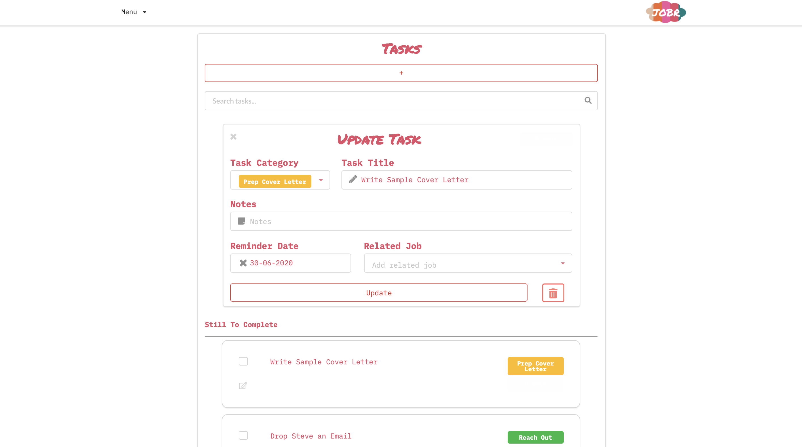 

9. Contacts Show Page - users can upload information for contacts they have met.

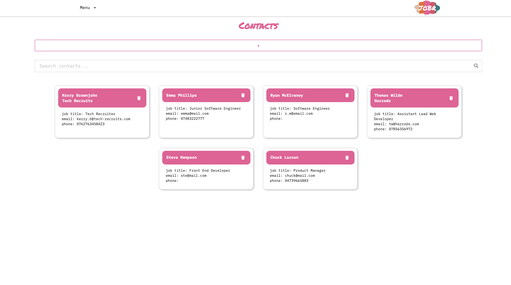 

10. Contacts Add Modal

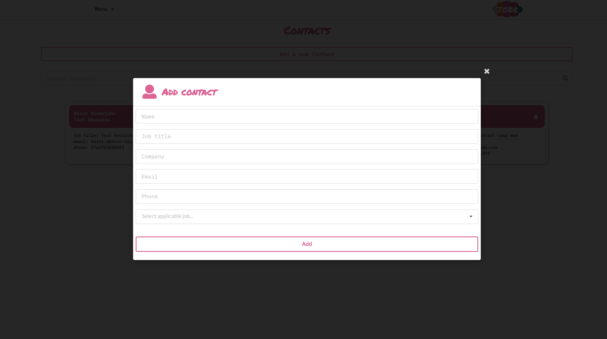 

10. Resources Show Page - users can upload urls to resources they have found whilst in the process of job hunting that they want to revisit later.

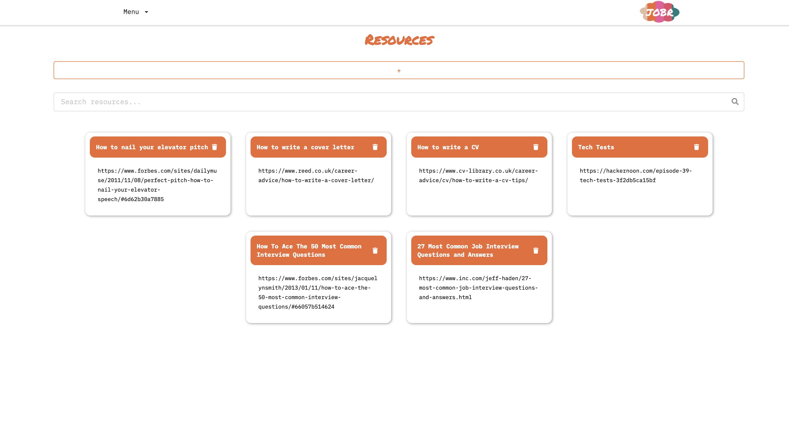 

11. Resources Add Modal 

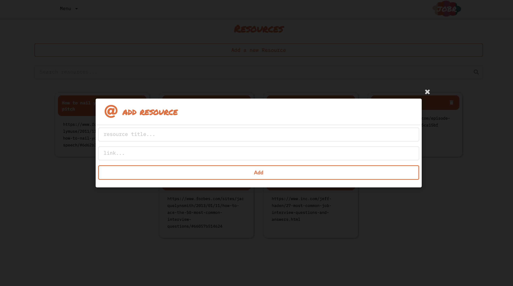 

-----

### Functionality 
Users can do the following:
* Register & Login
* Post, edit, delete jobs and tasks
* Drag & Drop jobs to update the status 
* Post & delete contacts and resources
* View tasks and contacts linked with a job

-----

### Process 

Given we were given a few days notice of the upcoming project our group had already spent some time discussing briefs and had agreed to build a job search tracker. We spent the first day drawing up the layout for the project on MIRO, particularly thinking about how they would look on both mobile and desktop, and thinking about the models and the relationships between them. 

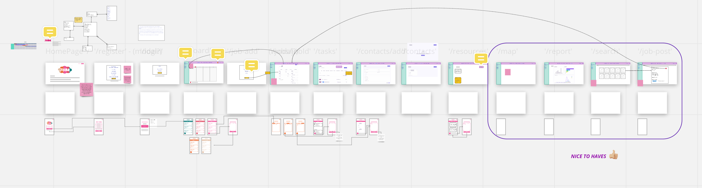 
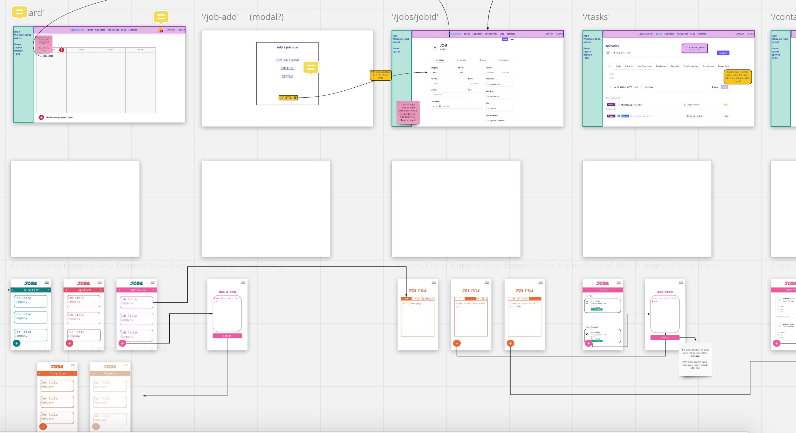 
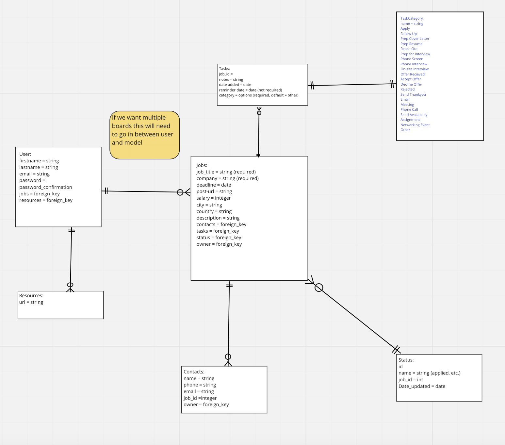 

#### Division of Work
We started on the backend and split the models equally between each of the three team members. Once each of the models were complete we worked together to create the relationships between them and updated the serializers accordingly. We carefully checked each of the routes worked on Insomnia and that we were recieving back the information we needed in the right format. Working in this way allowed us to have an oversight across the backend code which gave us a greater understanding of the project as a whole. 

On completion of the backend we moved onto the frontend, where we primarily continued to work with the models we had built on the backend. I initially made a start on the register & login forms and then moved back onto the Tasks pages. 

#### Featured Piece of Code 1

Task Model - on the backend I worked on creating the models for the tasks and the contacts. We created tasks and task categories as seperate models with a many to one relationship, each task could only be assigned one category, but one category could be assigned many tasks. I really enjoyed using Django and found it quite straight forward as long as you followed the steps carefully.

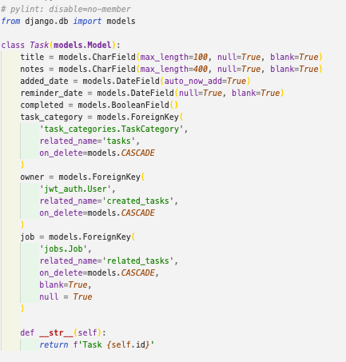

#### Featured Piece of Code 2
This was the first real opportunity we had to try out using React Hooks and agreed as a team that we would try to do so throughout. I built the useForm Hook which was really beneficial in this case as the majority of the app is based on forms so it was re-used multiple times. 

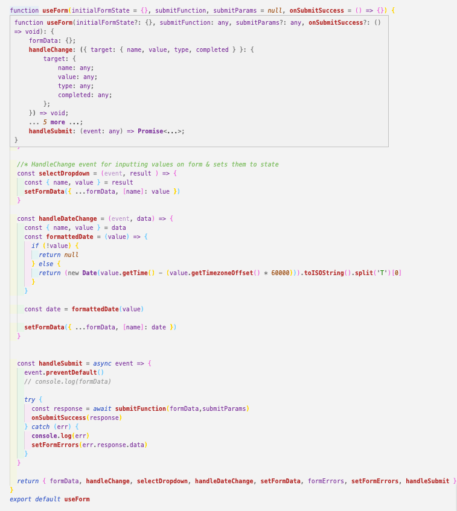

#### Featured Piece of Code 3
We wanted to make the app fully mobile responsive. As the device size reduced the number of status panels showing on the user dashboard reduced, requiring the user to scroll through them. In order to achieve this we needed to determine what size device the using the useWindowSize hook.

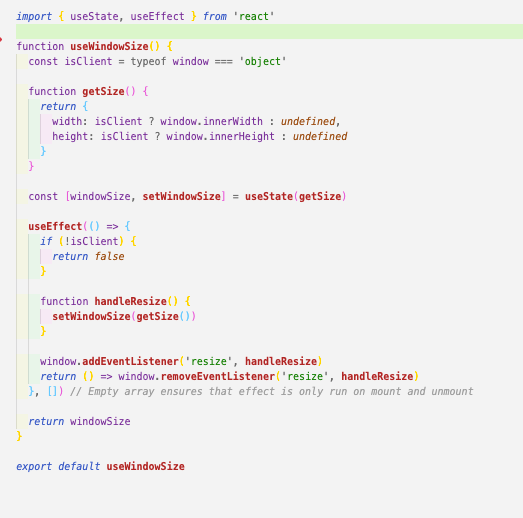

#### Styling
For this project we wanted to try a new styling framework and imported React Semantic UI. Previously we had only worked with one other framework before so this was a really good opportunity to experience something new. I found Semantic much more customisable and easier to understand than the previous framework. 

In order to make sure there wasn't a shortage of time and the end of the project we tried to style the pages as we went. I think this allowed us to achieve a really slick finish and make sure we had kept brand style consistent throughout.

------

### Wins and Blockers
The biggest wins and blockers from the project was that we successfully tried both Hooks and Semantic for the first time. Initially, this was much more time consuming getting to grips with them properly, but in the long run using Hooks allowed a lot of the code to be re-used and I found Semantic made it easier to style. 

-----

### Future Features 

Additional features I would like to include are
* Notifications on the dashboard - these would be linked to the dates set on the jobs and the tasks
* A job board page which consumes a public API of latest jobs, pre-filtered with your chosen industry. Users would be able to view the job information here and then add it onto their dashboard. 
* A feature which allows users to share their dashboards with others.
* Turn the app into a progressive web app.

-----

### Key Learnings 
By spending an extended period of time building the relationships between the models as a group and testing them out together on Insomnia really allowed us all to have a grasp of the code across the whole project which meant that if anyone came across a problem it was easier for everyone to step in and help debug. 

